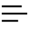

# Symbol Jump and Select

Show a QuickPick with all or just filtered symbols.  Click on an item to go to that symbol or to go AND select that entire symbol.

Here is an example of a keybinding:

```jsonc
{
  "key": "alt+o",       // whatever keybinding you want
  "command": "symbol-jump-and-select.showQuickPick",
  "args": {
    "symbols": [
      "class",
      "method",
      "function",
    ]
  }
}
```

You can filter by any combination of these symbols:

## `symbols` Options: string or array, optional, default = all symbols

Here are the symbols that can be used in the `symbols` option:

|              | symbols     |               |               |
|--------------|-------------|---------------|---------------|
| class        | method      | function      | property      |
| file         | module      | event         | operator      |
| namespace    | package     | struct        | typeParameter |
| variable     | field       | constant      | null          |
| enum         | interface   | constructor   | enumMember    |
| string       | number      | boolean       |               |
| array        | object      | key           |               |

If you omit the `symbols` option in your keybinding (or it is just an empty array), or if you invoke the command `symbol-jump-and-select.showQuickPick` from the Command Palette, the default is **all** of the symbols listed above.  For any particular language or file type, most of the symbols are not used anyway.  

## Extension Commands

This extension contributes the following command:

* `symbol-jump-and-select.showQuickPick`

```plaintext
// in the Command Palette:
Symbol Jump/Select: Open a quickpick of filtered symbols.
```

In the title bar of the QuickPick there is a **filter**  icon (  ) on the top right.  Toggling that icon will negate any filtering of the symbols (from your keybinding) and ALL symbols will be shown.  Toggling again will re-filter by your `symbols` in the keybinding, if any.

Each symbol that is shown will have a **selection** icon (  ) on its right when that line is highlighted or hovered.  Clicking that selection icon will make the cursor jump to that symbol and select it.  The entire symbol (and its children, if any) will be selected.  

Children are shown indented by ⮩'s to their proper depth.

* If you filter for some symbol in your keybinding, like 'constructor', and that symbol occurs within another symbolKind, like 'class', the parent symbol(s) (the 'class', for example) will be shown for context.

The QuickPick can also be filtered by the symbolKind (class, method, function,etc.) in the Input Box at the top.  This will filter by the symbols' names and Kinds.  So if you opened a quickPick of all symbols, you could then type 'class' to see only classes in the file listed or type 'function' or 'constructor', etc. to see only those Kind of symbols in the file.  

If you have already filtered by symbols in the keybinding, you can only search in the QuickPick for those shown symbol names and Kinds.  

## Arrow Functions and Function Names

Normally, in a javascript/typescript file these kinds of symbols would only be identified as `variables` and that is not very helpful:

```javascript
const someFunc = function (a) {...}   // this is a 'variable' symbol, NOT a 'function' symbol

const square = x => x * x;            // this is a 'variable' symbol, NOT a 'function' symbol
```

So this extension will determine if those 'variables' are in fact 'functions' and will identify them as such in the QuickPick.  Filtering for `function` in a keybinding will show these functions (despite the javascript language server identifying then as 'variables').  

## Release Notes

* 0.11&emsp;First Release.
